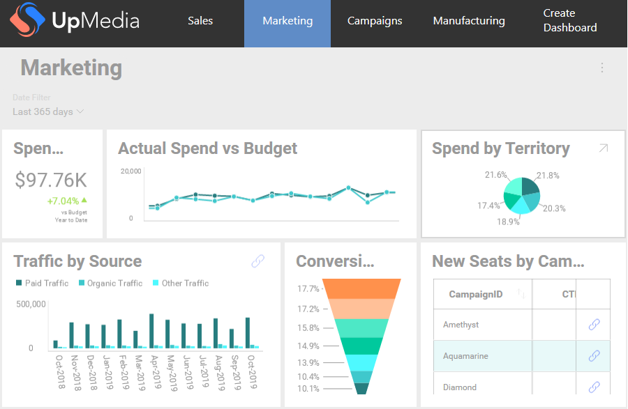

## ローカリゼーション サービスの使用

ローカリゼーション サービスは、カスタム ロジックに基づいてさまざまなダッシュボード要素をローカライズできます。また、フィールドのカスタム書式設定を設定する機能も提供します。

### ローカライズがサポートされる要素

ローカライズ可能なダッシュボード要素:

  * ダッシュボードのタイトル

  * ダッシュボード フィルター タイトル
  
  * 可視化フィルター タイトル
  
  * フィールド ラベル
  
  * 集計フィールド ラベル
  
### ローカリゼーション サービスの使用

以下は、リンクする方法の 2 つの例で [**ダッシュボード タイトルのローカライズ**](#localize-dashboard-title) およびカスタム ロジックを追加して同じダッシュボードで  [**フィールド ラベルをローカライズ**](#localize-field-label) する方法があります。 また、 [数値フィールド](#format-numeric-field) および [非集計日付フィールド](#format-date-field)の**書式設定を変更する方法**の例も示します。この例で使用するダッシュボードは、Marketing サンプル ダッシュボードです。

<a name='localize-dashboard-title'></a>
#### ダッシュボードのタイトルのローカライズの例

Marketing サンプルの初期状態:



以下の手順に従って、Marketing ダッシュボードのタイトルを Localized Marketing にローカライズします。

1.  ダッシュボードのローカライズを許可するには、カスタム実装に
    **LocalizationProvider** プロパティを設定する必要があります。

    ``` csharp
    RevealView.LocalizationProvider = new UpMediaLocalizationProvider()
    ```

2.  **IRVLocalizationProvider** の実装:

    ``` csharp
    public class UpMediaLocalizationProvider : IRVLocalizationProvider
    {
        public IRVLocalizationService GetLocalizationService()
        {
          return new UpMediaLocalizationService();
        }
    }
    ```

3.  ダッシュボード タイトルをローカライズするには、以下に示すように**IRVLocalizationService** で **GetLocalizedString** メソッドを実装します。

    ``` csharp
    public class UpMediaLocalizationService : IRVLocalizationService
    {
        public RVFormattingSpec GetFormattingSettingsForField(string fieldName, RVDashboardDataType dataType, RVFormattingSpec currentSettings, bool isAggregated)
        {
            return null;
        }

        public string GetLocalizedString(string originalValue, RVLocalizationElementType type)
        {
            if (type == RVLocalizationElementType.DashboardTitle && originalValue == "Marketing")
            {
                return "Localized Marketing";
            }

            return originalValue;
        }
    }
    ```

アプリを再度実行すると、ローカライズされたダッシュボードのタイトル (Localized Marketing) が表示されます。


<a name='localize-field-label'></a>
#### フィールド ラベルのローカライズの例

以下に、同じダッシュボードの複数の要素をローカライズする方法の例を示します。

以下は、Marketing サンプルの可視化 (Actual Spend vs Budget) の初期状態の 1 つの例です。


Date フィールド ラベルをローカライズするには、Date フィールドのローカライズを処理するロジックを **UpMediaLocalizationService** に追加する必要があります。

``` csharp
public class UpMediaLocalizationService : IRVLocalizationService
{
    public RVFormattingSpec GetFormattingSettingsForField(string fieldName, RVDashboardDataType dataType, RVFormattingSpec currentSettings, bool isAggregated)
    {
        return null;
    }

    public string GetLocalizedString(string originalValue, RVLocalizationElementType type)
    {
        if (type == RVLocalizationElementType.DashboardTitle && originalValue == "Marketing")
        {
            return "Localized Marketing";
        }
        else if (type == RVLocalizationElementType.FieldLabel && originalValue == "Date")
        {
            return "Localized Date";
        }

        return originalValue;
    }
}
```

Actual Spend vs Budget の Date フィールド ラベルが Localized Date に変更されました。


手順の例に従って、その他のダッシュボード要素をローカライズできます。

### ローカリゼーション サービスを使用した書式設定の変更

ローカリゼーション サービスを使用して数値フィールドと非集計日付フィールドの書式設定を変更できます。

<a name='format-numeric-field'></a>
#### 数値フィールドの書式設定の変更の例

以下の Spend vs Budget 可視化の初期状態では、米ドル($) 通貨で書式設定された数値フィールドを示します。


通貨書式を変更するには、新しい書式設定を作成し、**IRVLocalizationService** の実装の **GetFormattingSettingsForField** メソッドでそれらを返す必要があります。

コード スニペットは、数値の書式設定を日本円(¥) に変更し、小数桁なしで表示する方法を示します。

``` csharp
public class UpMediaLocalizationService : IRVLocalizationService
{
    public RVFormattingSpec GetFormattingSettingsForField(string fieldName, RVDashboardDataType dataType, RVFormattingSpec currentSettings, bool isAggregated)
    {
        if (fieldName == "Spend" && dataType == RVDashboardDataType.Number && isAggregated == true)
        {
            var newSettings = new RVNumberFormattingSpec()
            {
                ApplyMkFormat = false,
                CurrencySymbol = "¥",
                DecimalDigits = 0,
                FormatType = RVDashboardNumberFormattingType.Currency,
                NegativeFormat = RVDashboardNegativeFormatType.MinusSign,
                ShowGroupingSeparator = true
            };

            return newSettings;
        }

        return null;
    }

    public string GetLocalizedString(string originalValue, RVLocalizationElementType type)
    {
       ...
    }
}
```

現在、金額はその他の通貨で表示されます。


<a name='format-date-field'></a>
#### 日付フィールドの書式設定の変更の例

現在、集計された日付フィールドの書式設定の変更はローカリゼーション サービスでは設定できず、ピボットの値には影響しません。変更には[書式設定サービス](formatting-service.md)を使用してください。

ローカリゼーション サービスでは、**非集計日付フィールド**の書式設定を変更できます。 .

はじめに、集計データを除外するために、Actual Spend vs Budget 可視化を **Grid**に変更します。


Date フィールドの書式設定を変更するには、**GetFormattingSettingsForField** メソッドのロジックに設定を追加する必要があります。以下のコード スニペットは、January 01、2001 のように、日付形式を変更して月のフルネームを表示する方法を示します。

``` csharp
public RVFormattingSpec GetFormattingSettingsForField(string fieldName, RVDashboardDataType dataType, RVFormattingSpec currentSettings, bool isAggregated)
{
    if (fieldName == "Spend" && dataType == RVDashboardDataType.Number && isAggregated == true)
    {
        var newSettings = new RVNumberFormattingSpec()
        {
            ApplyMkFormat = false,
            CurrencySymbol = "¥",
            DecimalDigits = 0,
            FormatType = RVDashboardNumberFormattingType.Currency,
            NegativeFormat = RVDashboardNegativeFormatType.MinusSign,
            ShowGroupingSeparator = true
        };

        return newSettings;
    }
    else if (fieldName == "Date" && dataType == RVDashboardDataType.Date && isAggregated == false)
    {
        var newSettings = new RVDateFormattingSpec()
        {
            DateFormat = "MMMM dd,yyyy"
        };

        return newSettings;
    }

    return null;
}
```

> [!NOTE]
> フィールド名が Localized Date ではなく Date であるかどうかを確認する必要があることに注意してください。これは、フィールドの名前に基づいて書式設定が適用されるためです。この場合、Date はフィールドの名前で、Localized Date は表示されるラベルです。ダッシュボードを編集する場合、フィールド ラベルは変更できますが、フィールド名は元の名前のままです。

アプリを再度実行し、可視化をグリッドに変更すると更新された日付形式が表示されます。


