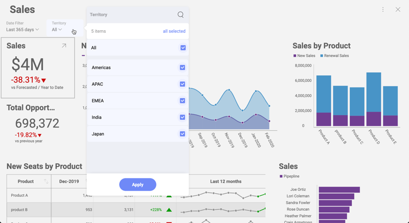

## 動的フィルター選択の設定

### 概要

アプリケーションにカスタム UI を統合し、選択した値の一覧をユーザーに表示する際に、そのユーザー選択をダッシュ​​ボードのフィルターと同期させたりすることもできます。

たとえば、現在の地域に基づいて数字を変更する Sales ダッシュボードと、地域を選択するためのカスタム UI を作成する場合、ユーザーが選択を変更後、Sales ダッシュボードにその変更を反映させます。ほとんどの場合、ダッシュボードに通常表示されているフィルター選択を非表示にします。これにより、ユーザーが画面領域を変更する 2 つの異なる方法を混同することはありません。



次のコードスニペットでは、説明したシナリオを実現する方法について詳しく説明しています。

``` csharp
private void Americas_Click(object sender, RoutedEventArgs e)
{
    revealView.SetFilterSelectedValues(
        revealView.Dashboard.GetFilterByTitle("Territory"),
        new List<object>() { "Americas" });
}
private void APAC_Click(object sender, RoutedEventArgs e)
{
    revealView.SetFilterSelectedValues(
        revealView.Dashboard.GetFilterByTitle("Territory"),
        new List<object>() { "APAC" });
}
```

上記でアメリカと APAC の間で選択した地域を変更するために 2 つのボタンが追加されました。コードにはクリック ハンドラーのみが含まれています。

__SetFilterSelectedValues__ を使用して新しい地域名を設定するだけで、セレクターで選択が変更されたときにも同じことができます。

### 動的リストの使用

アメリカ大陸、アジア太平洋地域、インドなどの地域は時間の経過とともに変化しませんが、他の値の一覧は変化する可能性があります。この場合、新しい地域がリストに追加されても、新しいボタンは自動的に追加されません。

__RevealUtility.GetFilterValues__ を使用して、特定のフィルター値の一覧を取得できます。この場合、次の呼び出しは territories 変数に __RVFilterValue__ オブジェクトを含む配列を残し、その後すべての領域を持つ ComboBox の項目のリストをロードします。

``` csharp
using (var stream = File.OpenRead(@"..\..\Sales.rdash"))
{
    var dashboard = await RevealUtility.LoadDashboard(stream);
    var settings = new RevealSettings(dashboard);

    revealView.Settings = settings;

    var filterValues = await RevealUtility.GetFilterValues(
        dashboard,
        dashboard.GetFilterByTitle("Territory"));
    var territories = filterValues.ToList();

    foreach (var t in territories)
    {
        cmbTerritories.Items.Add(t);
    }
    cmbTerritories.SelectionChanged += CmbTerritories_SelectionChanged;

}
```

その後、__RVFilterValue__ の label 属性を使用して地域の名前を表示し、Value 属性を使用してフィルターに選択を設定できます。

次のコードスニペットは、コンボボックスの選択変更イベントを処理してダッシュボードのフィルターを更新する方法を示しています。

``` csharp
private void CmbTerritories_SelectionChanged(object sender, SelectionChangedEventArgs e)
{
    var selectedItems = new List<object>();
    var filterValue = cmbTerritories.SelectedItem as RVFilterValue;
    if (filterValue != null)
    {
        selectedItems.Add(filterValue.Value);
    }
    revealView.SetFilterSelectedValues(
         revealView.Dashboard.GetFilterByTitle("Territory"),
         selectedItems);
}
```

### 日付フィルターでの作業

日付フィルターは、データが関連付けられていない特別な種類のフィルターです。選択できる値の一覧はありませんが、実際には時間間隔 (日付 A から日付 B まで) を選択します。Year To Date、Previous Month などの定義済みフィルタのリストから選択、または任意の範囲 (2019 年 1 月 12 日から 2019 年 1 月 30 日まで) を指定できます。

#### 定義済みフィルターでの作業

定義済みフィルターの 1 つを設定するには、次のようなコードを使用できます。

``` csharp
revealView.SetDateFilter(new RVDateDashboardFilter(RVDateFilterType.YearToDate));
```

すべての定義済み日付フィルターのリストが必要な場合は、API リファレンスの
__RVDateFilterType__ を参照してください。

#### カスタムな範囲での作業

たとえば過去 15 日間のカスタム範囲を設定する場合、以下のようなコードを使用できます。

``` csharp
revealView.SetDateFilter(
    new RVDateDashboardFilter(
        RVDateFilterType.CustomRange,
        new RVDateRange(DateTime.UtcNow.AddDays(-15), DateTime.UtcNow)
));
```

SDK とともに配布されている UpMedia WPF アプリケーションの UpMedia に、 **Sales.xaml.cs** の実用的な例があります。このサンプルビューには、日付範囲セレクタと、トグルボタンのリストとして表示される地域の 2 のカスタム フィルター コンポーネントが含まれています。
