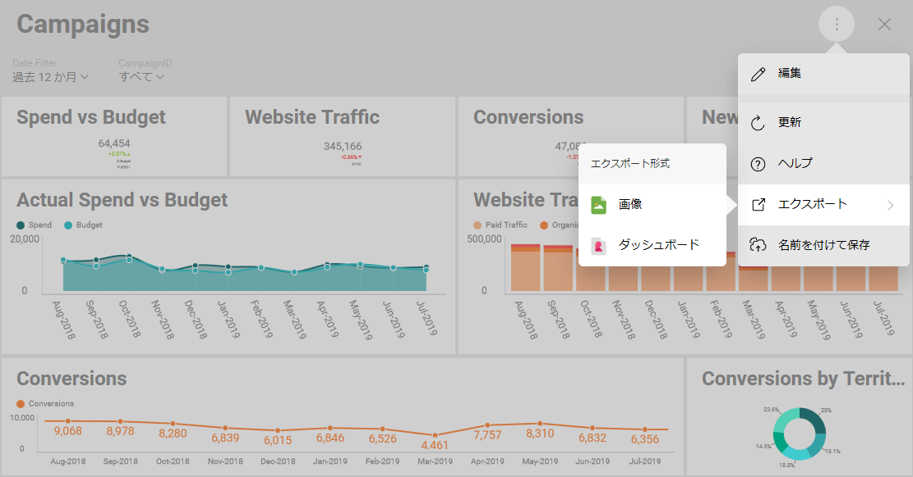

## SDK 用のダッシュボードの取得

### 概要

Reveal は、アプリに埋め込むように意図的に設計された ビジネス インテリジェンス プラットフォームです。埋め込み Reveal ダッシュボードは、ビジネスのステータス、メトリクス、またはパフォーマンスなどの情報を迅速かつ簡単に表示します。

Reveal SDK と Reveal アプリの違いを見てみましょう。

**Reveal アプリは**、データに基づく意思決定を迅速に行うことができるビジネス インテリジェンス ツールです。ダッシュボードを作成、表示およびチームと共有できます。また、使用するプラットフォーム（Web、デスクトップ、iOS、Android）に関係なく、同じエクスペリエンスを提供します。
Reveal アプリの詳細については、[**オンライン デモ**](https://app.revealbi.io/) にアクセスするか、[**ヘルプ ドキュメント**](https://www.revealbi.io/help/) を参照してください。

**Reveal SDK** を使用することにより、複数のプラットフォームおよびテクノロジで開発されたアプリに Reveal を埋め込むことができます。また、エンドユーザーが Reveal ダッシュボードの表示や修正を行うことができます。

### 概要

アプリケーションにダッシュボードを表示するには、はじめにプラットフォーム上の Reveal Application を使用してダッシュボードを作成する必要があります。

Reveal SDK を使用して最初からダッシュボードを作成することもできますが、最初に SDK を評価するときに推奨されるアプローチは、アプリで作成されたダッシュボードから始める方法です。

### ダッシュボード ファイルの取得

[ダッシュボードを作成した後](https://www.revealbi.io/help/creating-dashboards)、取得するには以下の手順に従ってください。

1.  **Reveal アプリでダッシュボードを開く**

    任意のプラットフォームに Reveal Application をインストールした後は、独自のダッシュボードを作成するか、アプリに付属のサンプル ダッシュボードのいずれかを使用できます。

2.  **エクスポート オプションにアクセス**

    オーバーフロー メニューに移動し、`[エクスポート]`、`[ダッシュボード]` の順に選択します。これにより、後で SDK を統合するときにアプリケーションで使用する拡張子 .rdash のファイルが生成されます。

    

    ダッシュボード ファイルは、電子メール (Android および iOS) を介してエクスポートすることも、コンピュータ上の .rdash ファイル (デスクトップおよび Web) としてエクスポートすることもできます。
