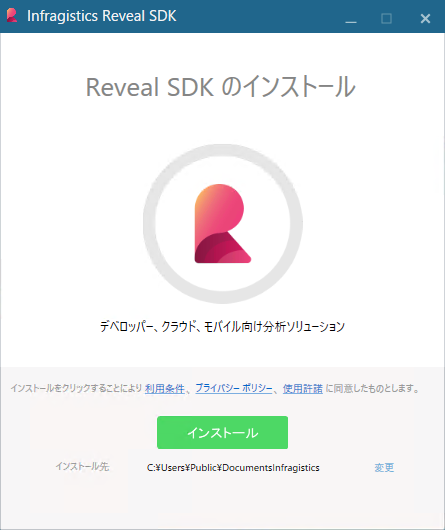
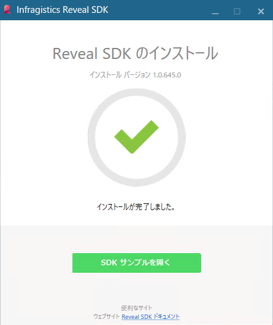

## インストールと要件

### デスクトップ SDK 要件

Reveal SDK は、.NET バージョン 4.6.1 以降および Visual Studio 2015 以降が必要です。

### ウェブ SDK 要件

Reveal Server SDK は、.NET Framework 4.6.1 をターゲットとする .NET Core 2+ サーバーサイド プロジェクトが必要です。

### Installing Reveal SDK

ウェブとデスクトップの両方のプラットフォーム用の Reveal SDK
は、[こちら](https://www.revealbi.io/jp)からダウンロードしてください。準備ができたら、インストーラーの手順に従います。

インストール完了後、`[SDK サンプルを開]`くリンクをクリックしてサンプルを表示できます。

### サンプル

サンプルは、%public%\\Documents\\Infragistics\\Reveal\\SDK\\ にあります。

ここにソリューション ファイル (Reveal.Sdk.Samples.sln) があります。このプロジェクトは、すべての Web、WPF、および WinForms サンプルを組み合わせたものです。

Web の場合、IIS でサンプルを実行し、StartUp プロジェクトを変更するには、ノード パッケージを復元する必要があります。復元するには、ソリューション エクスプローラーでソリューションを右クリックし、\[パッケージを復元\]を選択します。
