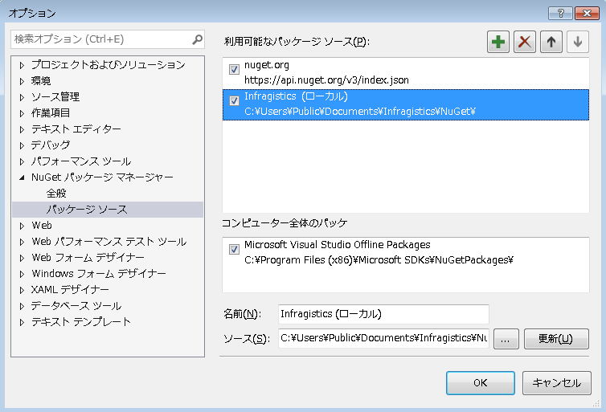

## セットアップと構成

Reveal Desktop SDK の設定は、次のいずれかを選択できます。

  - **NuGet** パッケージ マネージャの使用
  - プロジェクトを**手動**でセットアップ

### NuGet の使用 (推奨)

WPF または WinForms アプリケーション プロジェクトのセットアップには、**Infragistics.Reveal.Sdk.Wpf** パッケージをインストールする方法が最も簡単です。

Reveal SDK をインストールすると、%public%\\Documents\\Infragistics\\NuGet を指す
Infragistics (Local) と呼ばれる新しい NuGet パッケージソースが nuget.config に追加されます。



Infragistics (Local) フィードがインストーラーによって正しく設定されていることを確認後、**Infragistics.Reveal.Sdk.Wpf** パッケージをアプリケーション プロジェクトにインストールできます。

NuGet パッケージをインストールすると、以下の依存関係パッケージもインストールされます。

  - CefSharp.Wpf (57.0.0+)
  - SkiaSharp (1.68.0+)
  - System.Data.SQLite.Core (1.0.108+)

**CefSharp.Wpf** の既知の問題を処理するには、[**こちら**](#cefsharp-fix)を参照してください。

### 手動設定の使用

プロジェクトを手動で設定するには、以下の手順に従ってください。

1.  インストーラーによってドロップされたアセンブリへの参照を \<InstallationDirectory\>\\SDK\\WPF\\Binaries に追加します。

2.  RevealView コントロールが依存する以下の NuGet パッケージをインストールします。
      - CefSharp.Wpf (57.0.0+)
      - SkiaSharp (1.68.0+)
      - System.Data.SQLite.Core (1.0.108+)

以下は、CefSharp.Wpf の既知の問題を処理する方法です。

<a name='cefsharp-fix'></a>
### CefSharp 依存パッケージの処理

CefSharp 依存関係パッケージのインストールすると、ビルド (*AnyCPU* をターゲットにしている場合) が**失敗する**問題。

> [!NOTE]
> **エラーの詳細:** エラーの説明は次のようになります。
エラー: platform（x86/x64）を指定した場合、CefSharp.Commonはそのまま使用できます。AnyCPU サポートの場合は、この[リンク](https://github.com/cefsharp/CefSharp/issues/1714)を参照してください。

**このエラーを修正する**ためには、エラーの URL で説明されているように、CefSharpAnyCpuSupport プロパティをプロジェクト ファイルに追加する必要があります。アプリケーションの **.csproj** ファイルに以下のプロパティ グループを追加するのみです。

``` xml
<PropertyGroup>

  <CefSharpAnyCpuSupport>true</CefSharpAnyCpuSupport>

</PropertyGroup>
```

エラーの修正については以上です。CefSharp の GitHub Issues で示されている の手順を適用する必要はありません。Reveal コンポーネントは必要に応じて CefBrowser クラスを初期化します。

以上でプロジェクトで Reveal ダッシュボードを表示する設定が完了しました。
