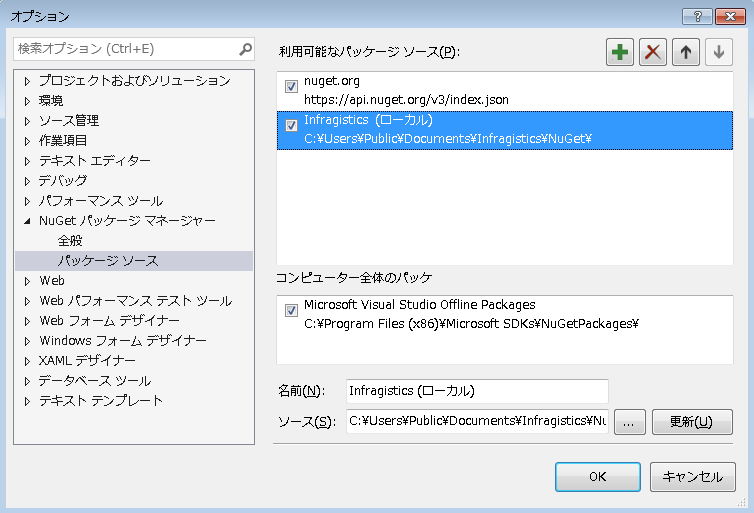

## セットアップと構成

### 前提条件

Reveal Server SDK には、.NET Core 2.2+ または .NET Framework 4.6.1+ ASP MVC アプリケーション プロジェクトが必要です。

NET Framework 4.6.1+ をターゲットとする場合、Reveal Server SDK には win7-x64 ランタイム環境がサポートされます。Web プロジェクトをデバッグするには、win7-x64 互換の RuntimeIdentifier プラットフォームを追加する必要があります。

``` xml
<PropertyGroup>

   <TargetFramework>net461</TargetFramework>

   <RuntimeIdentifier>win7-x64</RuntimeIdentifier>

</PropertyGroup>
```

### セットアップと構成の概要 

以下は、Reveal Web Server SDK 設定の手順です。

1.  [**アセンブリへの参照を追加し、依存関係パッケージをインストール**](#getting-assemblies-dependencies)

2.  [**サーバー コンテキストを定義**](#defining-server-context)

3.  [**サーバーSDKを初期化**](#initializing-server-sdk)

4.  [**サーバー側画像生成の有効化**](#server-side-image-export).

<a name='getting-assemblies-dependencies'></a>
#### 1\. アセンブリと依存関係パッケージの準備

アセンブリへの参照を追加して依存関係パッケージをインストールするには、**NuGet** パッケージ マネージャの使用をお勧めします。プロジェクトのセットアップには、**Infragistics.Reveal.Sdk.Web.AspNetCore** (トライアル) NuGet パッケージをインストールする方法が最も簡単です。

Reveal SDK をインストールすると、%public%\\Documents\\Infragistics\\NuGet を指す Infragistics (Local) と呼ばれる新しい NuGet パッケージソースが **nuget.config** に追加されます。



Infragistics (Local) フィードがインストーラーによって正しく設定されていることを確認後:

  - **Infragistics.Reveal.Sdk.Web.AspNetCore** NuGet パッケージを プロジェクトにインストールします。
  - NuGet パッケージ参照を System.Data.SQLite バージョン 1.0.111 以降に追加します。

ビルドに問題がある場合は、この [**リンク**](#sqlite-fix)を参照してください。

<a name='defining-server-context'></a>

<a name='defining-server-context'></a>
#### 2\. サーバー コンテキストの定義

必要な DLL を参照後、__IRevealSdkContext__ インターフェイスを実装するクラスを作成する必要があります。このインターフェイスは、Reveal SDK をアプリケーション内で実行できるようにし、SDK を操作するためのコールバックを提供します。

``` csharp
using Infragistics.Sdk;
public class RevealSdkContext : IRevealSdkContext
{
    public IRVDataSourceProvider DataSourceProvider => null;

    public IRVDataProvider DataProvider => null;

    public IRVAuthenticationProvider AuthenticationProvider => null;

    public async Task<Stream> GetDashboardAsync(string dashboardId)
    {
        return await Task.Run(() =>
        {
            //.rdash ファイルをストリームとしてロードして返します。
            var fileName = $"C:\\Temp\\{dashboardId}.rdash";
            return new FileStream(fileName, FileMode.Open, FileAccess.Read);
        });
    }

    //このコールバックは、RevealView　オブジェクトのクライアント側に onSave イベントがインストールされていない場合のみ使用されます。
    //詳細については、Web クライアント SDK のドキュメントをご覧ください。
    public async Task SaveDashboardAsync(string userId, string dashboardId, Stream dashboardStream)
    {
        // 編集したダッシュボードをここに保存します。
        await Task.Run(() => { });
    }
}
```

上記の実装は、C:\\Temp フォルダからダッシュボードをロードし、dashboardId 変数に依存する .rdash ファイルを検索します。アプリケーションでは、他のディレクトリやデータベースから、あるいは組み込みリソースからもダッシュボードを読み込めるよう変更します。

> [!NOTE]
> **null を返すプロパティ:** 最初の 3 つのプロパティ DataSourceProvider、DataProvider、および AuthenticationProvider はすべて null を返すように実装されています。このガイドでは、これらのプロパティのためにすべてのインターフェイスをインストールする方法について説明します。

<a name='initializing-server-sdk'></a>
#### 3\. サーバー SDK の初期化

**Startup.cs** のアプリケーションの **ConfigureServices** メソッドで
__RevealEmbedSettings__ クラスを渡し、サービス拡張メソッド AddRevealServices を呼び出します。

*AddRevealServices* 拡張メソッドは __Infragistics.Sdk__ 名前空間で定義されているため、ユーザーを追加する必要があります。また、以下に示すように **CachePath** プロパティも設定してください。

``` csharp
services.AddRevealServices(new RevealEmbedSettings
{
    LocalFileStoragePath = @"C:\Temp\Reveal\DataSources",
    CachePath = @"C:\Temp"
}, new RevealSdkContext());
```

> [!NOTE]
> **LocalFileStoragePath** は、ダッシュボード データソースとしてローカルの Excel ファイルまたは CSV ファイルを使用しており、RevealSdkContext クラスが前述のように IRevealSdkContext を実装している場合にのみ必要です。

MVC サービスを追加するときに **AddReveal** 拡張メソッドを呼び出すことによって、Reveal エンドポイントを追加できます。以下はコードスニペットです。

``` csharp
services.AddMvc().AddReveal();
```

AddRevealServices と同様に、AddReveal メソッドは Infragistics.Sdk
で定義されているため、ディレクティブを使用してください。

<a name='server-side-image-export'></a>
#### 4\. サーバー側画像生成の有効化

**画像エクスポート**機能 (プログラム上およびユーザー操作の両方により) を使用するには、以下の手順を実行する必要があります。

1.  **\<InstallationDirectory\>\\SDK\\Web\\JS\\Server** から以下の 3 つのファイルを取得します。
      - package.json
      - packages-lock.json
      - screenshoteer.js

2.  ファイルをプロジェクトのルート レベル (「wwwroot」の親フォルダー) にコピーします。

3.  **npm** (Node.js のパッケージ マネージャー) がインストールされていることを確認してください。

画像エクスポート機能が必要ない場合は、ファイルをプロジェクトにコピーする必要はありません。ただし、プロジェクトをビルドする場合、*npm* が見つからない警告メッセージが表示され、プロジェクトが正しく動作しません。

このエラーを解決するには、以下のプロパティをプロジェクトに追加します。

``` xml
<PropertyGroup>
  <DisableRevealExportToImage>true</DisableRevealExportToImage>
</PropertyGroup>
```

<a name='sqlite-fix'></a>
#### NuGet 使用時のビルドの問題

**SQLite.Interop.dll** に関連するデプロイメントの問題を処理するために、NuGet パッケージでカスタムの .targets ファイルが使用されています。

ビルドに問題がある場合は、プロジェクトに次のプロパティを追加してこの動作を無効にできます。

``` xml
<DisableSQLiteInteropFix>true</DisableSQLiteInteropFix>
```

### セットアップと構成 (クライアント)  

以下は、Reveal Web Client SDK を設定するための手順です。

1.  [**依存関係の確認**](#check-dependencies)

2.  [**Web Client SDK の参照**](#reference-web-client-sdk)

3.  [**Web Client SDK のインスタンス化**](#instantiate-web-client-sdk)

4.  [**React / Angular のサポートを設定**](#web-component-support) (オプション)

<a name='check-dependencies'></a>
#### 1\. 依存関係の確認
Reveal Web Client SDK には、サードパーティーの参照が 2 つあります。

  - jQuery 2.2 またはそれ以上
  - Day.js 1.8.15 またはそれ以上

<a name='reference-web-client-sdk'></a>

#### 2\. Web Client SDK の参照

Web ページで __$.ig.RevealView__ コンポーネントを有効にするには、いくつかの クリプトを含める必要があります。これらのスクリプトは Reveal Web Client SDK の一部として提供されます。

``` html
<script src="~/Reveal/infragistics.reveal.js"></script>
```

JavaScript ファイル は \<InstallationDirectory\>\\SDK\\Web\\JS\\Client にあります。


<a name='instantiate-web-client-sdk'></a>

#### 3\. Web Client SDK のインスタンス化

ダッシュボードのプレゼンテーションは、Web Client SDK を介してネイティブに処理されます。

以下の手順に従って作業を開始します。

1.  id を指定して \<div /\> 要素を定義し、__$.ig.RevealView__ コンストラクターを呼び出します。

    > [!NOTE]
    > **サーバー側とクライアント側のパーツを個別にホスト**
    > 個別のサーバーでクライアント側とサーバー側のパーツをホストする場合は、次の手順を続行する前に[こちら](~/jp/developer/web-sdk/sdk-overview-web.html#host-client-server-separate) を参照してください。

2.  コンストラクタで \_dashboardId\</emphasis\> を指定して __$.ig.RevealSettings__ のインスタンスを作成します。

3.  __$.ig.RevealUtility.loadDashboard__ を呼び出して dashboardId と成功およびエラーハンドラを指定します。

    a.  成功ハンドラーでは、取得したダッシュボードを使用し、__$.ig.RevealSettings__ オブジェクトの dashboard プロパティに設定する必要があります。

4.  最後に、2つのパラメータを渡して __$.ig.RevealView__ コンポーネントをインスタンス化します。1 つはダッシュボードをレンダリングする DOM 要素のセレクター、もう 1 つは設定オブジェクトです。

#### サンプル コード

``` html
<!DOCTYPE html>
<html>
<head>
    ⋮
    <script type="text/javascript">
        var dashboardId = "dashboardId";
        var revealSettings = new $.ig.RevealSettings(dashboardId);

        $.ig.RevealUtility.loadDashboard(dashboardId, function (dashboard) {
            revealSettings.dashboard = dashboard;
            var revealView = new $.ig.RevealView("#revealView", revealSettings);
        }, function (error) {
        //ここで発生する可能性があるエラーを処理します。
        });
    </script>
</head>
<body>
    <div id="revealView" style="height:500px;" />
</body>
</html>
```
<a name='web-component-support'></a>
#### 4\. React / Angular のサポートを設定 (オプション) 

フロントエンドでは、Reveal は Angular と React との互換性を提供する Web コンポーネントを提供します。

次のスニペットは、クライアント側で追加する必要があるものを示しています。

``` html
<script src="~/Reveal/reveal-webComponent.js"></script>
<section>
    <reveal-view dashboard-name="Sales" can-edit="" editing="" show-menu="" can-add-visualization=""</reveal-view>
</section>
```

Web コンポーネントには他の依存関係も含める必要があることに注意してください (jQuery 2.2以降およびInfragistics.reveal.js)。

次の 2 つの JS ファイルが "\<InstallationDirectory\>\\Web\\JS" にあります。

  - **reveal-webComponent.js**
  - **reveal-WebComponent-ie11.js**

#### IE11 サポート

IE11 ユーザーをサポートする場合について説明します。以下のスニペットでほとんどのブラウザーで問題なく動作します。

``` html
@section Scripts {
    <script src="https://cdnjs.cloudflare.com/ajax/libs/babel-polyfill/7.4.4/polyfill.min.js"></script>
    <script src="https://unpkg.com/@@webcomponents/webcomponentsjs/webcomponents-loader.js"></script>
    <script src="~/Reveal/reveal-webComponent-ie11.js"></script>
}
<section>
    <reveal-view dashboard-name="Sales"></reveal-view>
```

ただし、フロントエンドのパフォーマンスを向上させたい場合や、IE11 を考慮しない場合は、上記の他のスニペットを確認し、代わりに **reveal-webComponent.js** を使用してください。
