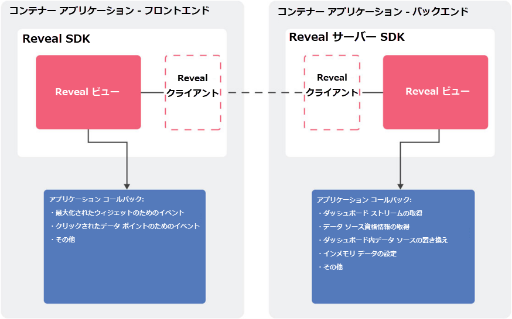

## Web SDK の概要

Web アプリケーションに Reveal を組み込む場合、2 つのコンポーネントが常に関係しているため、アーキテクチャはネイティブ アプリよりも少々複雑になります。

  - **Reveal クライアント SDK**： Web アプリケーションに統合する必要がある JavaScript ライブラリと CSS ファイルのセット。現在サポートされているフレームワークは、jQuery、Angular、および React です。

  - **Reveal サーバー SDK**: サーバーアプリケーションに統合されるサーバー側のコンポーネント。.NET ランタイム v4.6.1 またはそれ以降を使用する ASP.NET Core アプリケーションです。今後、.NET Core を使ったライブラリを提供予定です。

以下の図では、Reveal Web SDK を埋め込んだ Web アプリケーションのアーキテクチャを表示しています。



上記のように、SDK はネイティブ アプリケーションとほとんど同様に機能します。違いは、一部のコールバックがクライアント側で呼び出され (データポイントがクリックされたときに送信されるイベントなど)、その他はサーバー側で呼び出される (ダッシュボードのロードまたはメモリ内データの提供のためのコールバックなど) 点です。

<a name='host-client-server-separate'></a>
### クライアント側とサーバー側の部分のホスト (異なるサーバーを利用)

クライアント側とサーバー側のパーツを個別に、たとえば異なる URL でホストできます。

これには、以下のようにウィンドウ オブジェクトのプロパティを設定します。

``` js
window.IGAppBaseURL = "{back-end base url}";
```

プロパティを正しく設定するには、**末尾にスラッシュ記号が必要です**。

このプロパティは、[*.ig.RevealView のインスタンス化*](~/jp/developer/general/setup-configuration-web.html#instantiate-web-client-sdk) の前に設定します。
