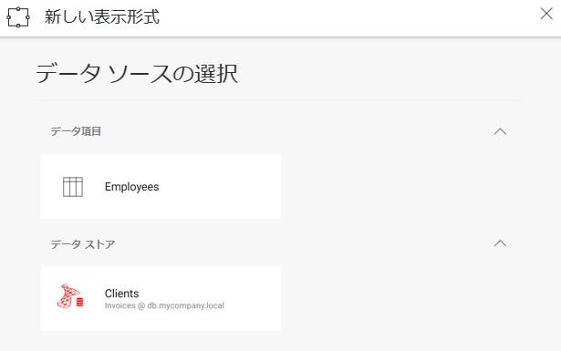

## 新しい可視化とダッシュボードの作成

### 概要

[**ダッシュボードの編集と保存**](editing-saving-dashboards.md)で説明したように、ダッシュボードの変更を保存する方法を処理する方法は 2 つ (**クライアント サイドとサーバー サイド**) あります。これらのシナリオは、ユーザーが既存のダッシュボードに以下のような変更を加える際には正しく機能します。

  - フィルターの追加/編集
  - 視覚化のタイプを変更する (チャート、ゲージ、グリッドなど)
  - テーマの変更

ただし、新しい視覚化を追加するには、ユーザーは使用する**データソースを選択する**必要があります。そのためには、含まれているアプリケーションが SDK に情報を提供する必要があるので、新しい可視化に使用できるデータソースのリストを表示できます。

### データソースのリストを表示

データソースのリストを表示するために使用する必要があるコールバックは、__onDataSourcesRequested__ です。このコールバックに独自の関数を設定しない場合、新しいビジュアライゼーションが作成されると、Reveal はダッシュボードで使用されているすべてのデータソースを表示します (存在する場合)。

#### コード:

以下のコードは、インメモリ項目と SQL Server データソースを表示するようにデータソース選択画面を構成する方法を示しています。

``` js
window.revealView.onDataSourcesRequested = function (callback) {
    var inMemoryDSI = new $.ig.RVInMemoryDataSourceItem("employees");
    inMemoryDSI.title("Employees");
    inMemoryDSI.description("Employees");

    var sqlDs = new $.ig.RVSqlServerDataSource();
    sqlDs.title("Clients");
    sqlDs.id("SqlDataSource1");
    sqlDs.host("db.mycompany.local");
    sqlDs.port(1433);
    sqlDs.database("Invoices");

    callback(new $.ig.RevealDataSources([sqlDs], [inMemoryDSI], false));
};
```

3 番目のパラメータの “false” 値は、ダッシュボード上の既存のデータソースが表示されないようにします。そのため、\[+\]
ボタンを使用して新しいウィジェットを作成すると、以下の画面が表示されます。



RVInMemoryDataSourceItem コンストラクタに渡される employees パラメーターは、[**インメモリ データのサポート**](~/jp/developer/web-sdk/using-the-server-sdk/in-memory-data.md)で使用されているコンストラクタと同じデータセット ID で、サーバー側で返されるデータセットを識別します。

### 新しいダッシュボードの作成

以下の手順でダッシュボードを簡単に作成できます。

  - ダッシュボード属性を RevealSettings に設定せず、更に __\$.ig.RevealUtility.loadDashboard__ を使用せずに __\$.ig.RevealView__ と __\$.ig.RevealSettings__ オブジェクトを初期化します。

  - ダッシュボードを編集モードで起動するには、isEditing を true に設定します。

<!-- end list -->

``` js
var revealSettings = new $.ig.RevealSettings(null);
revealSettings.startInEditMode = true;
var revealView = new $.ig.RevealView("#revealView", revealSettings);
```

SDK とともに配布されている UpMedia ウェブ アプリケーションに、**CreateDashboard.cshtml** の実用的な例が含まれます。
