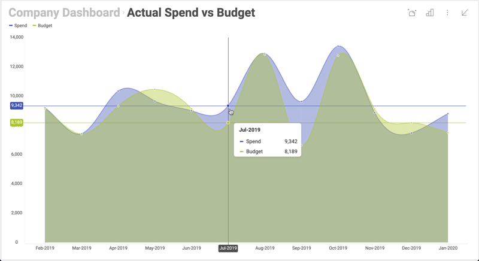
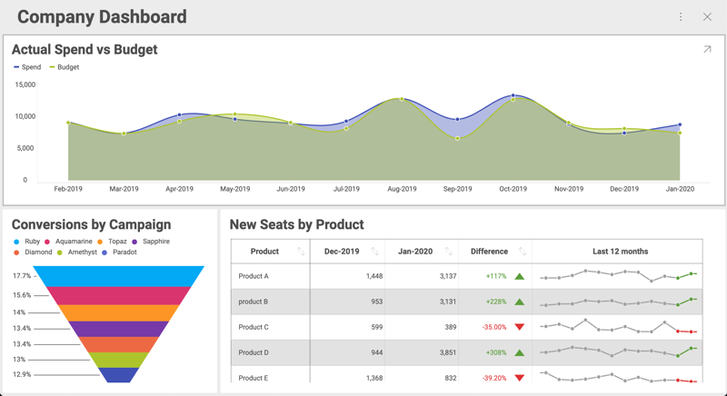

## 可視化の最大化と単一可視化モード

### 概要

Web Client SDK は、ダッシュボードをユーザーに表示する際に最大化した可視化表示を 1
つだけ表示し、更に最初の可視化表示をロックしてユーザーがダッシュボード全体にアクセスできないようにすることができます。



#### Example Details

可視化した 3 つのダッシュボードがあり、それぞれの可視化に会社の異なる部門のデータが表示されているとします。



この例では、業務アプリケーションでこれらの可視化を使用します。各部署のホームページに表示される情報の一部として含めます。

### 可視化の最大化

最大化されたビジュアライゼーションでダッシュボードを開くには、__$.ig.RevealSettings__ の __MaximizedVisualization__ 属性を使用する必要があります。 
この属性に視覚化を設定しない場合、ダッシュボード全体が表示されます。

[**$.ig.RevealView オブジェクトの構成**](configuring-revealview.md)に示すように、ページに特定のダッシュボードを表示できます。今回は、__MaximizedVisualization__ 属性を設定する必要があります。以下のコードスニペットに示すように、ID が AllDivisions のダッシュボードから可視化した Sales が表示されています。

``` html
<script type="text/javascript">
...

var dashboardId = 'AllDivisions';
var revealSettings = new $.ig.RevealSettings(dashboardId);

$.ig.RevealUtility.loadDashboard(dashboardId, function (dashboard) {
    revealSettings.dashboard = dashboard;

    revealSettings.maximizedVisualization = dashboard.getVisualizationByTitle('Sales');

    new $.ig.RevealView("#revealView", revealSettings);
}, function (error) {
    console.log(error);
});
</script>

<div id="revealView" style="height:500px;" />
```

最初に最大化した可視化表示は Sales というタイトルの可視化になりますが、それでもエンドユーザーはダッシュボードに戻って残りの可視化を表示できます。

### 単一可視化モード

また、最初の可視化をロックして、常に可視化を 1 つのみ表示するようにすることもできます。これにより、ダッシュボードは単一の視覚化ダッシュボードのように機能します。これが \[単一可視化モード\] の概念です。

\[単一可視化モード\]をオンにするには、以下のように __singleVisualizationMode__ を true に設定します。

``` js
$.ig.revealSettings.singleVisualizationMode = true;
```

この 1 行を追加すると、ダッシュボードは単一の視覚化ダッシュボードとして機能します。各部門のホームページでも同じことができます。__getVisualizationByTitle__ のビジュアライゼーションのタイトルを正しいものに置き換えてください。

#### ロックされた可視化を動的に変更

ページを再ロードせずに、表示されている単一のビジュアライゼーションを動的に変更することもできます。ユーザーの観点から見ると、アプリは部門のセレクターと最大化された視覚化を備えた単一ページのアプリケーションになります。ユーザーがリストから 1 つの部門を選択すると、最大化された視覚化が更新されます

以下では、__\$.ig.RevealView__ の __maximizeVisualization__ メソッドを使用します。

``` html
<script type="text/javascript">
    var dashboardId = 'AllDivisions';
    var revealSettings = new $.ig.RevealSettings(dashboardId);

    $.ig.RevealUtility.loadDashboard(dashboardId, function (dashboard) {
        revealSettings.dashboard = dashboard;
        revealSettings.singleVisualizationMode = true;
        revealSettings.maximizedVisualization = dashboard.getVisualizationByTitle('Sales');

        window.revealView = new $.ig.RevealView("#revealView", revealSettings);
    }, function (error) {
        console.log(error);
    });
    function maximizeVisualization(title) {
        window.revealView.maximizeVisualization(
            window.revealView.dashboard.getVisualizationByTitle(title)
        );
    }
</script>

<section style="display:grid;grid-template-rows:30px auto;">
    <section style="display:grid;grid-template-columns:auto auto auto;">
        <button onclick="maximizeVisualization('Sales')">Sales</button>
        <button onclick="maximizeVisualization('HR')">HR</button>
        <button onclick="maximizeVisualization('Marketing')">Marketing</button>
    </section>
    <div id="revealView" style="height:500px;" />
</section>
```

注意事項:

- __\$.ig.RevealView__ オブジェクトは  window.revealView に設定し、後で __maximizeVisualization__ が呼び出されたときに使用できます。
- div の前のセクションに追加されたボタンは、例として使用しています。最大化された可視化を切り替える手段として追加されました。ここでは、アプリケーションで同様のコードを使用する必要があります。
- この例では、サンプル ダッシュボードのビジュアライゼーションと一致するようにボタンがハードコードされていますが、ダッシュボードのビジュアライゼーションのリストを繰り返すことでボタンのリストを動的に生成することもできます。詳細については、__\$.ig.RVDashboard.visualizations__ をご覧ください。