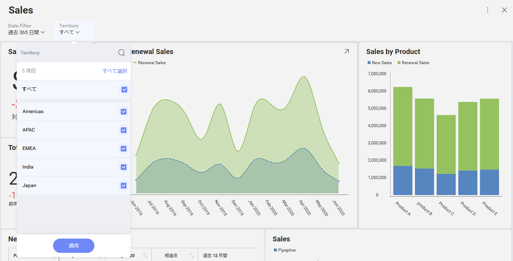

## 動的フィルター選択の設定

### 概要

アプリケーションにカスタム UI を統合し、選択した値の一覧をユーザーに表示する際に、そのユーザー選択をダッシュ​​ボードのフィルターと同期させたりすることもできます。

たとえば、現在の地域に基づいて数字を変更する Sales ダッシュボードと、地域を選択するためのカスタム UI を作成する場合、ユーザーが選択を変更後、Sales ダッシュボードにその変更を反映させる必要があります。ほとんどの場合、ダッシュボードに通常表示されているフィルター選択を非表示にします。これにより、ユーザーが画面領域を変更する 2 つの異なる方法を混同することはありません。



次のコードスニペットでは、説明したシナリオを実現する方法について詳しく説明しています。

``` html
<script type="text/javascript">
    var dashboardId = 'Sales';
    var revealSettings = new $.ig.RevealSettings(dashboardId);

    $.ig.RevealUtility.loadDashboard(dashboardId, function (dashboard) {
        revealSettings.dashboard = dashboard;
        revealSettings.showFilters = false;

        window.revealView = new $.ig.RevealView("#revealView", revealSettings);
    }, function (error) {
        console.log(error);
    });
    function setSelectedTerritory(territory) {
        var filter = window.revealView.dashboard.getFilterByTitle('Territory');
        window.revealView.setFilterSelectedValues(filter, [territory]);
    }
</script>

<section style="display:grid;grid-template-rows:30px auto;">
    <section style="display:grid;grid-template-columns:auto auto auto auto auto;">
        <button onclick="setSelectedTerritory('Americas')">Americas</button>
        <button onclick="setSelectedTerritory('APAC')">APAC</button>
        <button onclick="setSelectedTerritory('EMEA')">EMEA</button>
        <button onclick="setSelectedTerritory('India')">India</button>
        <button onclick="setSelectedTerritory('Japan')">Japan</button>
    </section>
    <div id="revealView" style="height:500px;" />
</section>
```

上記でダッシュボードの上部に 5 つのボタン (アメリカ、APAC、EMEA、インド、日本) が追加されました。ダッシュボードの各地域に 1 つずつあります。

### 動的リストの使用

アメリカ大陸、アジア太平洋地域、インドなどの地域は時間の経過とともに変化しませんが、他の値の一覧は変化する可能性があります。この場合、新しい地域がリストに追加されても、新しいボタンは自動的に追加されません。

__$.ig.RevealUtility.getFilterValues__ を使用して特定のフィルター値の一覧を取得することができます。この場合、次の呼び出しは \_window.territories\</emphasis\> に 5 つの __$.ig.RVFilterValue__ オブジェクトを含む配列を残します。

``` js
var filter = window.revealView.dashboard.getFilterByTitle('Territory');
$.ig.RevealUtility.getFilterValues(dashboard, filter, function (values) {
    window.territories = values;
}, function (error) {
    console.log(error);
});
```

__$.ig.RVFilterValue__ の label 属性を使用して地域の名前を表示し、Value 属性を使用してフィルターに選択を設定できます。
以下のコード スニペットは、自動的に地域を選択するための ComboBox を設定する方法を示します。


``` html
<script type="text/javascript">
    var dashboardId = 'Sales';
    var revealSettings = new $.ig.RevealSettings(dashboardId);

    $.ig.RevealUtility.loadDashboard(dashboardId, function (dashboard) {
        revealSettings.dashboard = dashboard;
        revealSettings.showFilters = false;

        window.revealView = new $.ig.RevealView("#revealView", revealSettings);

        var filter = window.revealView.dashboard.getFilterByTitle('Territory');
        $.ig.RevealUtility.getFilterValues(dashboard, filter, function (values) {
            window.territories = values;
            var buttonsPanel = $('#buttonsPanel')[0];
            for (var i = 0; i < values.length; i++) {
                var button = $('<button onclick="setSelectedTerritory(window.territories[' + i + '].values)">' + values[i].label + '</button>');
                buttonsPanel.append(button[0]);
            }
        }, function (error) {
            console.log(error);
        });
    }, function (error) {
        console.log(error);
    });
    function setSelectedTerritory(territory) {
        var filter = window.revealView.dashboard.getFilterByTitle('Territory');
        window.revealView.setFilterSelectedValues(filter, [territory]);
    }
</script>

<section style="display:grid;grid-template-rows:30px auto;">
    <section style="display:grid;grid-template-columns:auto auto auto auto auto;" id="buttonsPanel">
    </section>
    <div id="revealView" style="height:500px;" />
</section>
```

上の図のように、ボタンを含むセクションには、buttonsPanel という ID が割り当てられています。次に、JQuery を使用してボタンを動的に作成し、それらを DOM 文書に追加します。

変数 window.territories は地域のリストを保持し、後で各ボタンの onclick コードの値を選択するときに使用されます。
