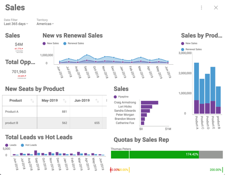

## 初期フィルター選択の設定

### 概要

すでに適用されているフィルターを含むダッシュボードを表示したい場合は、ダッシュボード フィルターですべてのウィジェットのコンテンツを一度にスライスすると非常に便利です。
これにより、SDK を使用して、すべてのダッシュボードのウィジェットに対してコンテキスト内に留まる最初のダッシュボード フィルター選択を設定できます。

#### 例の詳細

この例では、Sales データを表示するダッシュボードには以下のフィルターがあります。
  - 一定期間 (過去 365 日、年累計など)
  - 地域 (南北アメリカ、ヨーロッパ、アジアなど)



### コード例

この場合、初期フィルター選択を次のように設定します。

  - 過去 1 年間 ("過去365日" の代わりとなる、このダッシュボードのデフォルト設定)。
  - 現在のユーザーの地域に関連付けられている売上。

初期化プロセスの一部として、そしてダッシュボードがロードされたら、ダッシュボード内のフィルターのリストを取得し、これらのフィルターを使用して __$.ig.RevealSettings__ で最初に選択された値を設定できます。

``` html
<script type="text/javascript">
    var dashboardId = 'Sales';
    var revealSettings = new $.ig.RevealSettings(dashboardId);

    $.ig.RevealUtility.loadDashboard(dashboardId, function (dashboard) {
        revealSettings.dashboard = dashboard;

        revealSettings.setDateFilter(new $.ig.RVDateDashboardFilter($.ig.RVDateFilterType.YearToDate));
        revealSettings.setFilterSelectedValues(
            dashboard.getFilterByTitle("Territory"),
            [getCurrentUser().territory]
        );

        new $.ig.RevealView("#revealView", revealSettings);
    }, function (error) {
        console.log(error);
    });
</script>

<div id="revealView" style="height:500px;" />
```

> [!NOTE]
> 上記のコードは、**getCurrentUser().territory** が現在のユーザーの地域を返すことを前提としています。

#### フィルターの非表示化

ユーザーが自分の地域以外のデータにアクセスしたくない場合があります。 このような場合、ダッシュボード フィルターを含むパネルを非表示にするように __$.ig.RevealView__ オブジェクトを設定することで、フィルターへのアクセスを制限できます。

``` js
$.ig.revealSettings.showFilters = false;
```

この設定では、関連する地域のデータのみを表示するようにユーザーを制限します。

最後に、それでもユーザーに日付フィルターの選択を変更させたい場合は、[**動的フィルター選択の設定**](setting-dynamic-filters.md)をご覧ください。ユーザーが日付フィルターを変更できるようにするための独自の UI を作成する方法についての情報があります。
