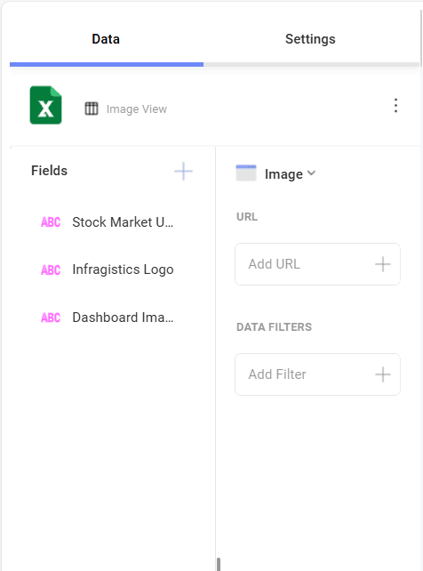

# Creating an Image Chart

In this tutorial you will learn how to create an *Image* visualization
using a sample spreadsheet.

## Key Concepts

As mentioned in the Data Visualization section, the Image Chart displays information in an embedded browser by making
a request to a URL and displaying the results. The data source,
therefore, will need to:

  - Include a link to a web resource to be displayed in the widget.

  - Include it **in the first row of the data set**.

## Sample Data Source

For this tutorial, you will use the *Image Chart* sheet in the <a href="/data/Reveal_Visualization_Tutorials.xlsx" download>Reveal Visualization Tutorials</a>.

 1. Choose **Edit** in overflow menu.
   
    

 2. Select the **+ Visualization** button in the top right-hand corner.

     

 3. Select your data source from the list of data sources.

    

 4. Once the data source is configured, select the *Image View* sheet.                                

    

 5. By default, the visualization type will be set to **Column**. Select the **Image** option.      

       
                                                      
 6. Drag any of the available fields into **URL**.        

                                                          
