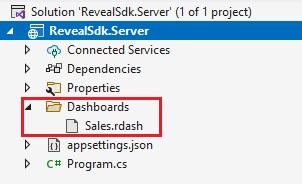
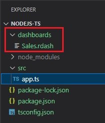

import Tabs from '@theme/Tabs';
import TabItem from '@theme/TabItem';

# Loading Dashboards

Reveal Dashboards are stored on the server. The client application will make a call to the `$.ig.RVDashboard.loadDashboard` method passing in the name of the dashboard to load. The request for the dashboard is sent to the server and the server will respond to the client with the requested dashboard. The client will take the dashboard provided in the server response, and set the `RevealView.dashboard` property.

By default, the Reveal SDK uses a convention to load dashboards from a file path. Specifically, the Reveal SDK will look for dashboards in a **Dashboards** folder in the working directory on the server.

1 - In the server application, create a folder named **Dashboards** in the working directory and place a dashboard file within the folder.

<Tabs groupId="code" queryString>
  <TabItem value="aspnet" label="ASP.NET" default>



  </TabItem>

  <TabItem value="java" label="Java">

:::danger Unsupported

Java does not currently support a default dashboard loader. You must create a custom dashboard provider.

:::

  </TabItem>

  <TabItem value="node" label="Node.js">    



  </TabItem>
</Tabs>

2 - In the client application, call the `$.ig.RevealSdkSettings.setBaseUrl` method and pass in your server URL. When debugging, the server URL will be `https://localhost` followed by a port number. For example:

```js
$.ig.RevealSdkSettings.setBaseUrl("https://localhost:5111/");   
```

:::caution

Calling the `$.ig.RevealSdkSettings.setBaseUrl` is required when the server is running on a different URL than the client application. If both the server application and the client application are running on the same URL, this method is not required. This method only needs to be called once.

:::

3 - Make a call to the `$.ig.RVDashboard.loadDashboard` method and pass the name of the dashboard file without the .rdash extension. This method has a callback which will provide the dashboard being requested from the server. Once you have received the dashboard from the callback, get an instance of the `$.ig.RevealView` and set the `RevealView.dashboard` property to the dashboard in the response.

```js
$.ig.RVDashboard.loadDashboard("Sales", (dashboard) => {
    var revealView = new $.ig.RevealView("#revealView");
    revealView.dashboard = dashboard;
});
```

:::info Get the Code

The source code to this sample can be found on [GitHub](https://github.com/RevealBi/sdk-samples-javascript/tree/main/LoadingDashboards).

:::

## Custom Dashboard Provider

If the default **Dashboards** file directory is not an option for your application, you can provide a custom dashboard provider in which to load the dashboards instead.

1 - Create the dashboard provider.

<Tabs groupId="code" queryString>
  <TabItem value="aspnet" label="ASP.NET" default>

```cs
public class DashboardProvider : IRVDashboardProvider
{
    public Task<Dashboard> GetDashboardAsync(IRVUserContext userContext, string dashboardId)
    {
        throw new NotImplementedException();
    }

    public Task SaveDashboardAsync(IRVUserContext userContext, string dashboardId, Dashboard dashboard)
    {
        throw new NotImplementedException();
    }
}
```

  </TabItem>

  <TabItem value="java" label="Java">

```java
public class DashboardProvider implements IRVDashboardProvider {

    @Override
    public InputStream getDashboard(IRVUserContext userContext, String dashboardId) throws IOException {
        return null;
    }

    @Override
    public void saveDashboard(IRVUserContext arg0, String arg1, InputStream arg2) throws IOException {
        return null;
    }	
}
```

  </TabItem>

  <TabItem value="node" label="Node.js">    

```ts
const dashboardProvider = async (userContext:IRVUserContext | null, dashboardId: string) => {
	return null;
}
```

  </TabItem>
</Tabs>

2 - Register the dashboard provider with the Reveal SDK.

<Tabs groupId="code" queryString>
  <TabItem value="aspnet" label="ASP.NET" default>

```cs
builder.Services.AddControllers().AddReveal( builder =>
{
    builder.AddDashboardProvider<DashboardProvider>();
});
```

  </TabItem>

  <TabItem value="java" label="Java">

```java
RevealEngineInitializer.initialize(new InitializeParameterBuilder().
    setDashboardProvider(new DashboardProvider()).
    build());
```

  </TabItem>
  
  <TabItem value="node" label="Node.js">    

```ts
const revealOptions: RevealOptions = {
	dashboardProvider: dashboardProvider,
};

app.use("/", reveal(revealOptions));
```

  </TabItem>

</Tabs>


## Example: Load from File Path

<Tabs groupId="code" queryString>
  <TabItem value="aspnet" label="ASP.NET" default>

```cs
public class DashboardProvider : IRVDashboardProvider
{
    public Task<Dashboard> GetDashboardAsync(IRVUserContext userContext, string dashboardId)
    {
        var filePath = Path.Combine(Environment.CurrentDirectory, $"MyDashboardsFolder/{dashboardId}.rdash");
        var dashboard = new Dashboard(filePath);
        return Task.FromResult(dashboard);
    }

    public Task SaveDashboardAsync(IRVUserContext userContext, string dashboardId, Dashboard dashboard)
    {
        throw new NotImplementedException();
    }
}
```

  </TabItem>

  <TabItem value="java" label="Java">

```java
public class RevealDashboardProvider implements IRVDashboardProvider {

    @Override
    public InputStream getDashboard(IRVUserContext userContext, String dashboardId) throws IOException {
        InputStream dashboardStream = new FileInputStream("dashboards/" + dashboardId + ".rdash");
        return dashboardStream;
    }

    @Override
    public void saveDashboard(IRVUserContext arg0, String arg1, InputStream arg2) throws IOException {
        
    }	
}
```

  </TabItem>

  <TabItem value="node" label="Node.js">    

```ts
const dashboardProvider = async (userContext:IRVUserContext | null, dashboardId: string) => {
	return fs.createReadStream(`myDashboards/${dashboardId}.rdash`);
}
```

  </TabItem>
</Tabs>

:::info

The source code to this sample can be found on [GitHub](https://github.com/RevealBi/sdk-samples-javascript/tree/main/LoadingDashboards-File).

:::


## Example: Load from Resource

1 - Embed a Reveal dashboard **.rdash** file as a resource in your server application.

<Tabs groupId="code" queryString>
  <TabItem value="aspnet" label="ASP.NET" default>

To embed a Reveal dashboard **.rdash** file as a resource in your ASP.NET server application, open the Properties for the dashboard file in Visual Studio, and set the **Build Action** of the .rdash file to **EmbeddedResource**.


  </TabItem>

  <TabItem value="java" label="Java">

To embed a Reveal dashboard **.rdash** file as a resource in your Java server application, place the dashboard file in the **resources** directory.


  </TabItem>

</Tabs>

2 - Create the dashboard provider.

<Tabs groupId="code" queryString>
  <TabItem value="aspnet" label="ASP.NET" default>

```cs
public class DashboardProvider : IRVDashboardProvider
{
    public Task<Dashboard> GetDashboardAsync(IRVUserContext userContext, string dashboardId)
    {
        var resource = Assembly.GetExecutingAssembly().GetManifestResourceStream($"RevealSdk.Server.Dashboards.{dashboardId}.rdash");
        using (resource)
        {
            var dashboard = new Dashboard(resource);
            return Task.FromResult(dashboard);
        }
    }

    public Task SaveDashboardAsync(IRVUserContext userContext, string dashboardId, Dashboard dashboard)
    {
        throw new NotImplementedException();
    }
}
```

:::note

The `name` of the resource you will provide in the `Assembly.GetManifestResourceStream` method must include the `namespace` and file name of the .rdash file.

:::

  </TabItem>

  <TabItem value="java" label="Java">

```java
public class RevealDashboardProvider implements IRVDashboardProvider {

    @Override
    public InputStream getDashboard(IRVUserContext userContext, String dashboardId) throws IOException {
        InputStream dashboardStream = getClass().getResourceAsStream("/dashboards/" + dashboardId + ".rdash");
		return dashboardStream;
    }

    @Override
    public void saveDashboard(IRVUserContext arg0, String arg1, InputStream arg2) throws IOException {
        
    }	
}
```

  </TabItem>

</Tabs>

:::info Get the Code

The source code to this sample can be found on [GitHub](https://github.com/RevealBi/sdk-samples-javascript/tree/main/LoadingDashboards-Resource).

:::

## Example: Load From JSON

For advanced users, or users that serialize Reveal dashboards into .json files instead of .rdash files, you can load these JSON based files using the `Dashboard.LoadFromJsonAsync` method on the server application.

<Tabs groupId="code" queryString>
  <TabItem value="aspnet" label="ASP.NET" default>

```cs
public class DashboardProvider : IRVDashboardProvider
{
    public Task<Dashboard> GetDashboardAsync(IRVUserContext userContext, string dashboardId)
    {
        var filePath = Path.Combine(Environment.CurrentDirectory, $"Dashboards/{dashboardId}.json");
        var json = File.ReadAllText(filePath);
        var dashboard = Dashboard.FromJsonString(json);
        return Task.FromResult(dashboard);
    }

    public Task SaveDashboardAsync(IRVUserContext userContext, string dashboardId, Dashboard dashboard)
    {
        throw new NotImplementedException();
    }
}
```

  </TabItem>

  <TabItem value="java" label="Java">

:::danger Unsupported

This feature is currently not supported by Java

:::

  </TabItem>

  <TabItem value="node" label="Node.js">    

:::danger Unsupported

This feature is currently not supported by Node.js

:::

  </TabItem>
</Tabs>

:::caution

Manipulating or changing the contents of a Reveal dashboard after it has been serialized to JSON can break the integrity of the dashboard and cause irreversible damage to the contents of the dashboard. This could result in runtime exceptions being thrown in your application due to errors and/or a failure to load the dashboard.

:::

:::info Get the Code

The source code to this sample can be found on [GitHub](https://github.com/RevealBi/sdk-samples-javascript/tree/main/LoadingDashboards-Json).

:::
